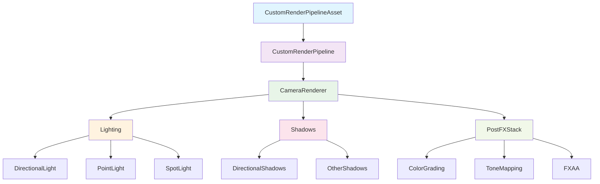
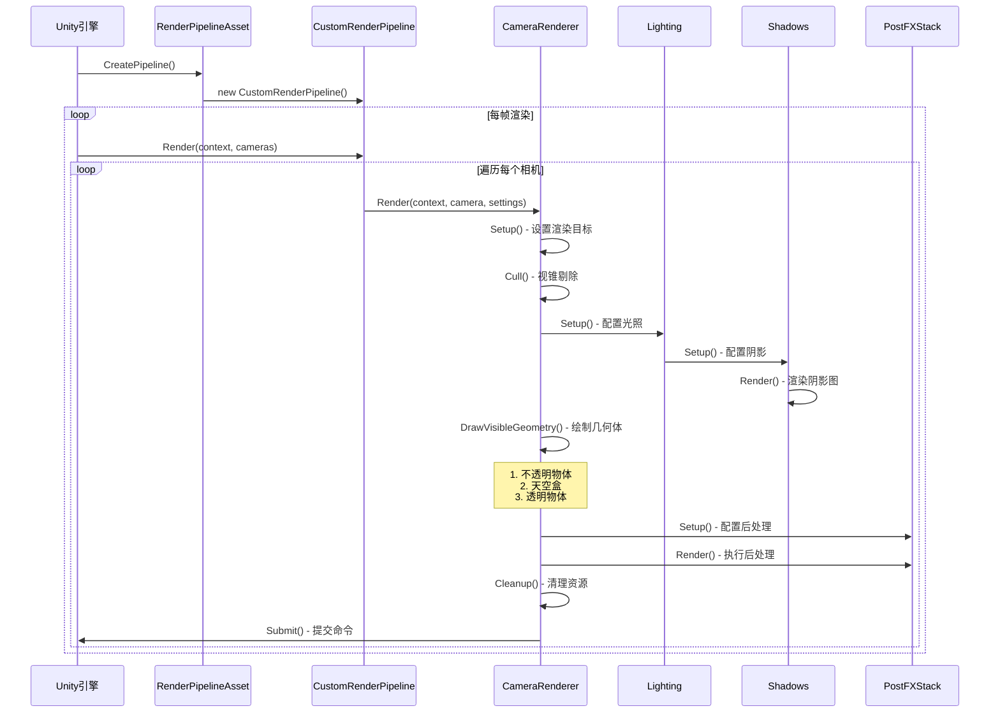
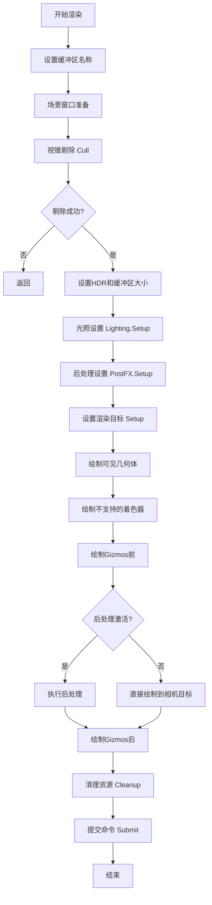
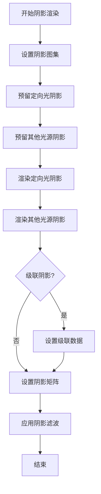
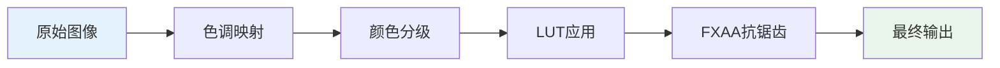

# Unity SRP Demo 项目（unity 2022版本）

🌟 **Unity可编程渲染管线（Scriptable Render Pipeline）学习示例项目**

本项目是一个完整的Unity自定义渲染管线实现，包含了现代3D渲染的核心功能：光照、阴影、后处理等。适合学习Unity SRP架构和现代渲染技术。

## 📁 项目结构

```
Assets/CustomRP/
├── Runtime/                     # 运行时核心代码
│   ├── CustomRenderPipelineAsset.cs    # 渲染管线资产
│   ├── CustomRenderPipeline.cs         # 渲染管线主类
│   ├── CameraRenderer.cs               # 相机渲染器
│   ├── Lighting.cs                     # 光照系统
│   ├── Shadows.cs                      # 阴影系统
│   ├── PostFXStack.cs                  # 后处理栈
│   └── ...
├── Shaders/                     # 着色器文件
│   ├── Lit.shader                      # 标准光照着色器
│   ├── Unlit.shader                    # 无光照着色器
│   ├── PostFXStack.shader              # 后处理着色器
│   └── ...
├── ShaderLibrary/               # 着色器库
│   ├── Common.hlsl                     # 通用函数
│   ├── Lighting.hlsl                   # 光照计算
│   ├── Shadows.hlsl                    # 阴影计算
│   └── ...
├── Settings/                    # 配置类
├── Editor/                      # 编辑器扩展
└── Examples/                    # 示例代码
```

## 🏗️ 架构概览

### 核心组件关系图



## 🔄 渲染流程时序图



## 🔧 核心系统详解

### 1. 渲染管线入口

#### CustomRenderPipelineAsset
- **作用**: 渲染管线的配置资产，可在Inspector中调整参数
- **核心功能**:
  - 配置批处理选项（Dynamic Batching, GPU Instancing, SRP Batcher）
  - 设置光照选项（逐对象光照）
  - 配置阴影和后处理设置

#### CustomRenderPipeline
- **作用**: 渲染管线的主要执行者
- **核心功能**:
  - 初始化CameraRenderer
  - 遍历所有相机并调用渲染

### 2. 相机渲染系统

#### CameraRenderer 渲染流程



### 3. 光照系统

#### Lighting 核心功能
- **支持光源类型**:
  - 定向光（Directional Light）：最多4个
  - 点光源（Point Light）：最多64个
  - 聚光灯（Spot Light）：最多64个

- **光照数据存储**:
  ```csharp
  // 定向光数据
  static Vector4[] dirLightColors = new Vector4[maxDirLightCount];
  static Vector4[] dirLightDirectionsAndMasks = new Vector4[maxDirLightCount];
  
  // 其他光源数据
  static Vector4[] otherLightColors = new Vector4[maxOtherLightCount];
  static Vector4[] otherLightPositions = new Vector4[maxOtherLightCount];
  ```

### 4. 阴影系统

#### Shadows 阴影映射流程



- **支持功能**:
  - 级联阴影映射（Cascaded Shadow Maps）
  - 多种PCF滤波（3x3, 5x5, 7x7）
  - 阴影遮罩（Shadow Mask）支持
  - 点光源立方体阴影

### 5. 后处理系统

#### PostFXStack 处理链



- **支持的后处理效果**:
  - **色调映射**: ACES Tone Mapping
  - **颜色分级**: 亮度、对比度、色彩、饱和度调整
  - **FXAA**: 快速近似抗锯齿
  - **LUT**: 查找表颜色校正

## 🎮 场景示例

项目包含16个渐进式学习场景：

- **Scene1-3**: 基础渲染设置
- **Scene4-6**: 光照系统演示
- **Scene7-9**: 阴影效果展示
- **Scene10-12**: 透明度和混合
- **Scene13-15**: 后处理效果
- **Scene16**: 综合应用

## 🚀 快速开始

### 1. 环境要求
- Unity 2021.3 LTS 或更高版本
- 支持SRP的渲染后端

### 2. 设置渲染管线
1. 在Project窗口中找到`CustomRP.asset`
2. 在Graphics Settings中将其设为Scriptable Render Pipeline Settings
3. 打开任意Scene场景进行测试

### 3. 自定义配置
```csharp
// 在CustomRenderPipelineAsset中调整设置
[SerializeField]
bool useDynamicBatching = true;    // 动态批处理
bool useGPUInstancing = true;      // GPU实例化
bool useSRPBatcher = true;         // SRP批处理器
bool useLightsPerObject = true;    // 逐对象光照
```

## 📚 学习路径建议

### 初学者路径
1. **Scene1-3**: 了解基础渲染设置和着色器
2. **阅读**: `CameraRenderer.cs` 的基础渲染流程
3. **实践**: 修改`Unlit.shader`，添加简单效果

### 进阶路径
1. **Scene4-9**: 深入学习光照和阴影系统
2. **阅读**: `Lighting.cs` 和 `Shadows.cs`
3. **实践**: 实现自定义光照模型

### 高级路径
1. **Scene10-16**: 学习高级渲染技术
2. **阅读**: `PostFXStack.cs` 后处理实现
3. **实践**: 添加新的后处理效果

## 🔗 关键代码文件解析

### CustomRenderPipeline.cs
```csharp
protected override void Render(ScriptableRenderContext context, Camera[] cameras)
{
    // 遍历所有相机单独渲染
    foreach (Camera camera in cameras)
    {
        renderer.Render(context, camera, /* 参数... */);
    }
}
```

### CameraRenderer.cs 核心方法
- `Render()`: 主渲染入口
- `Setup()`: 设置渲染目标
- `DrawVisibleGeometry()`: 绘制几何体
- `Cleanup()`: 资源清理

### Lighting.cs 光照计算
- `SetupDirectionalLight()`: 定向光设置
- `SetupPointLight()`: 点光源设置
- `SetupSpotLight()`: 聚光灯设置

## 🛠️ 扩展建议

### 添加新功能
1. **体积光**: 在`PostFXStack`中添加体积散射
2. **屏幕空间反射**: 实现SSR效果
3. **延迟渲染**: 支持延迟渲染路径
4. **集群光照**: 实现Clustered Lighting

### 性能优化
1. **GPU剔除**: 实现GPU-driven渲染
2. **异步计算**: 利用Compute Shader优化
3. **LOD系统**: 集成距离级别细节

## 📖 参考资料

- [Unity SRP官方文档](https://docs.unity3d.com/Manual/ScriptableRenderPipeline.html)
- [Catlike Coding SRP教程](https://catlikecoding.com/unity/tutorials/custom-srp/)
- [Real-Time Rendering](http://www.realtimerendering.com/)

## 🤝 贡献

欢迎提交Issue和Pull Request来改进这个学习项目！

## 📄 许可证

本项目采用MIT许可证，详见LICENSE文件。

---

**Happy Rendering! 🎨** 
